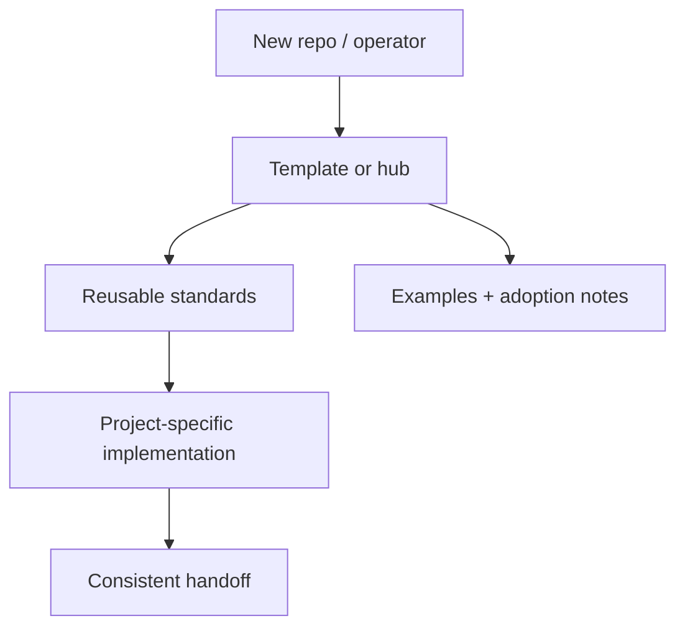
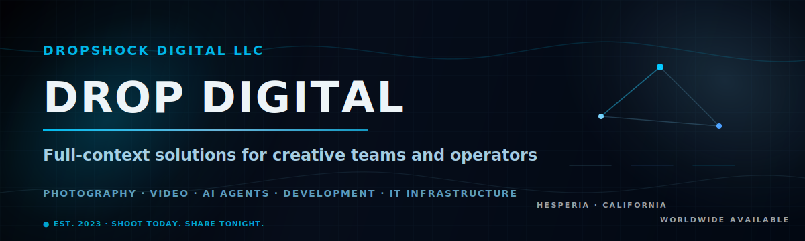

# DropShock Digital GitHub Profile

   

Organization profile README for DropShock Digital.

Built and maintained by **DropShock Digital**.

---

## First screen

| Area | Detail |
| --- | --- |
| Repository | [`DropShock-Digital/.github`](https://github.com/DropShock-Digital/.github) |
| Primary class | profile / organization hub |
| Current posture | needs explicit status confirmation |
| Default branch | `main` |
| Visibility | public |
| Last README standardization | 2026-06-26 |

## What matters

- Make the repo purpose obvious in the first 30 seconds.
- Put the architecture or workflow in a visual map before deep prose.
- Keep commands, environment notes, and handoff risks close to the top.
- Credit the real builder/maintainer while keeping client or project context separate from implementation notes.
- Audit priority: `P2`

## System map




### Visual proof



## Best features carried forward

- Visual-first GitHub Markdown is kept, but constrained to one clear hero/asset lane.

## Operate this repo

**Detected stack:** No package/deploy metadata detected yet

```bash
# Add verified setup/run commands here.
```

> Commands above are inferred from repository files and should be verified before they become release or client handoff instructions.

## Documentation map

- No dedicated docs files detected yet; use this README as the current source of truth.

## Handoff notes

| Area | Detail |
| --- | --- |
| Secrets | No `.env.example` was detected; add one before documenting environment-specific setup. |
| License | No license file detected in the repo scan. |
| Owner credit | Built and maintained by DropShock Digital. |
| Next documentation move | Add `docs/ARCHITECTURE.md` with the full system diagram and decisions. |

## Maintenance standard

This README follows the DropShock repo documentation format: one clear identity, one visual map, a short operator path, explicit ownership, and deeper detail moved into linked docs when needed. If the repo grows, add or update `docs/ARCHITECTURE.md`, `docs/DEPLOYMENT.md`, and `docs/OPERATIONS.md` instead of turning the README into a wall of text.
